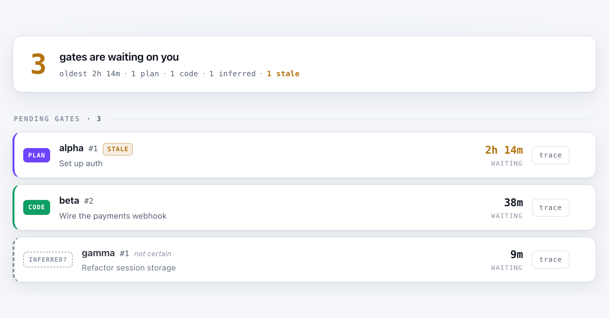

# ml-os — Gate Inbox

**A read-only inbox for the moments your AI agents wait on you.**

If you build with [ay-framework](https://github.com/liwala/ay-framework), every task
runs autonomously except two human approvals: the plan and the code. Those gates wait
silently inside terminal sessions. Run a few projects at once and an agent can sit
blocked for hours before you notice.

ml-os is one local page that answers: **what is waiting on ME right now, across all
projects?** Pending gates on top, oldest first, stale ones escalated — plus a macOS
notification the moment a gate flips pending, and one click to jump into the exact
session that's waiting.



## Features

- **Gate inbox** — every pending `/go` gate across your registered repos, oldest
  first, with task titles, live waiting times, and stale escalation
- **Native notifications** — fires once per gate transition; clicking the banner
  opens the inbox (terminal-notifier backend)
- **Jump to session** — clicking a gate focuses the waiting session (cmux, or any
  command you configure)
- **Project boards** — each repo's task board, blockers included, rendered from its
  `.ay/` tracking files
- **Trace chain** — click any task to walk its plan → handoffs → commits timeline
- **Gate inference** — repos without the gate marker still show a clearly-labeled
  "inferred" gate when a task lock looks stuck
- **Read-only by construction** — ml-os never writes into a watched repo. No
  database, no build step, zero dependencies (Python stdlib + one HTML file)

## Quickstart

Requires Python 3.11+ and macOS for notifications (the viewer itself is
cross-platform). For clickable notifications: `brew install terminal-notifier`.

```bash
git clone https://github.com/ayMuLIAICHI/ml-os.git
cd ml-os
cp config.example.toml config.toml   # then edit: register your repos
python3 -m mlos.server
```

Open http://localhost:8787. The tab title carries the pending-gate count.

## Configuration

Everything lives in `config.toml` (see `config.example.toml` for the annotated
template). Registering a project is one block:

```toml
[[repos]]
name = "my-project"
path = "~/code/my-project"
```

**Security note:** the server is unauthenticated and `/api/jump` runs a configured
local command, so it binds `127.0.0.1` by default. Binding `0.0.0.0` (to check gates
from your phone) is an explicit opt-in — only on a network you trust.

## How it works

ml-os reads `<repo>/.ay/tracking/gates/*.gate` markers. A marker's presence means a
`/go` cycle is waiting on a human; the marker's JSON carries the gate type (`plan` or
`code`) and since-timestamp, and the repo's `/go` deletes it on response. Boards,
blockers, plans, handoffs, and commit logs come from the same `.ay/` tree. That
filesystem is the only seam — which is also what makes the whole app testable against
golden fixtures.

Full design: [docs/ARCHITECTURE.md](docs/ARCHITECTURE.md).

## Test

```bash
python3 -m unittest discover -s tests
```

Runs against golden fixture `.ay/` trees in `fixtures/` — no live agents, injected
clocks, deterministic.

## Dogfood proof

ml-os was built through ay-framework itself: registered in its own config, it renders
its own build chain — the tasks, plans, handoffs, and commits that produced it.

## License

[MIT](LICENSE)
